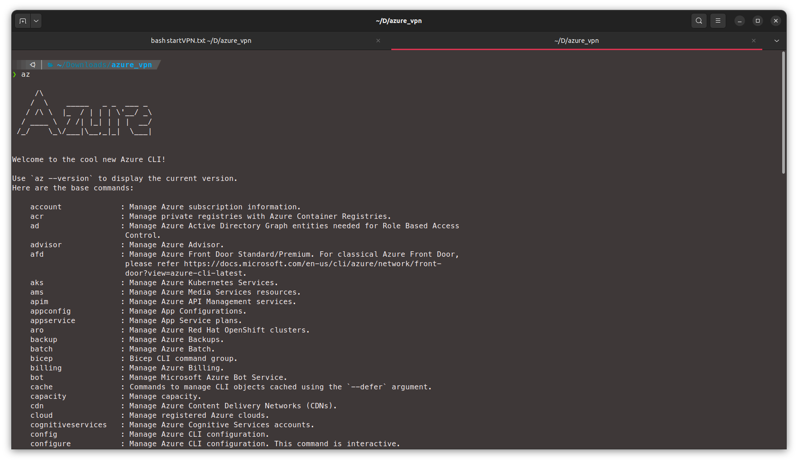
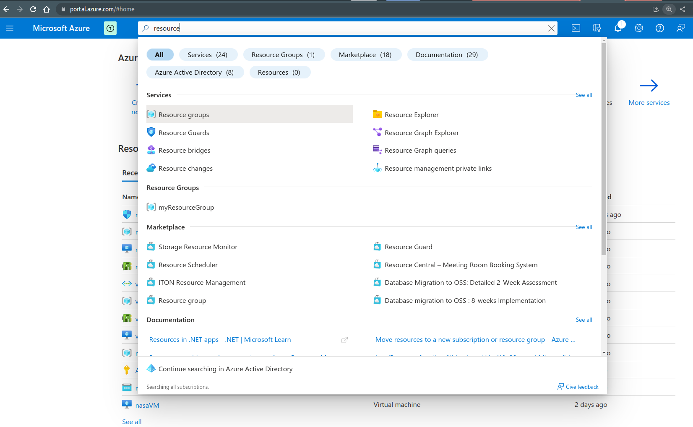
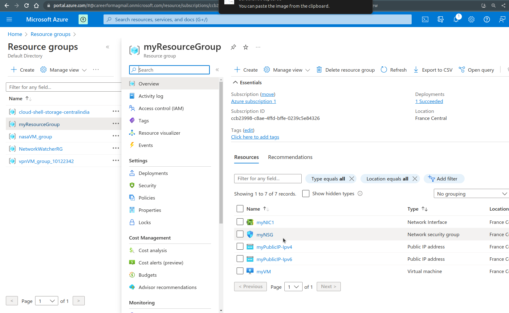
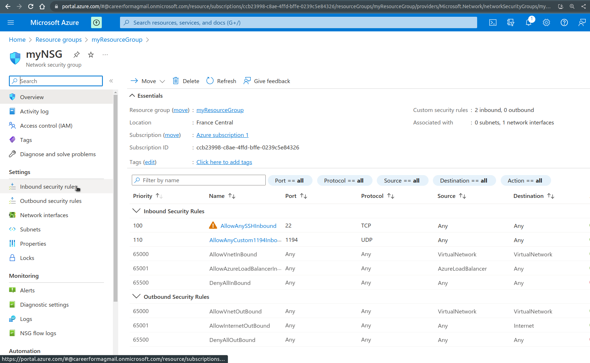
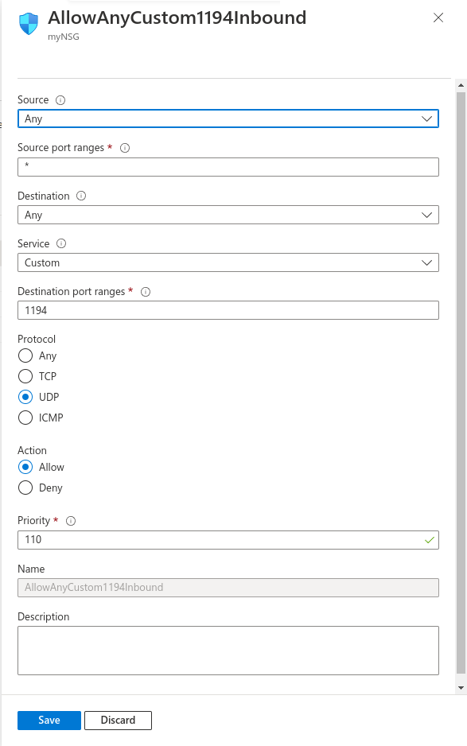
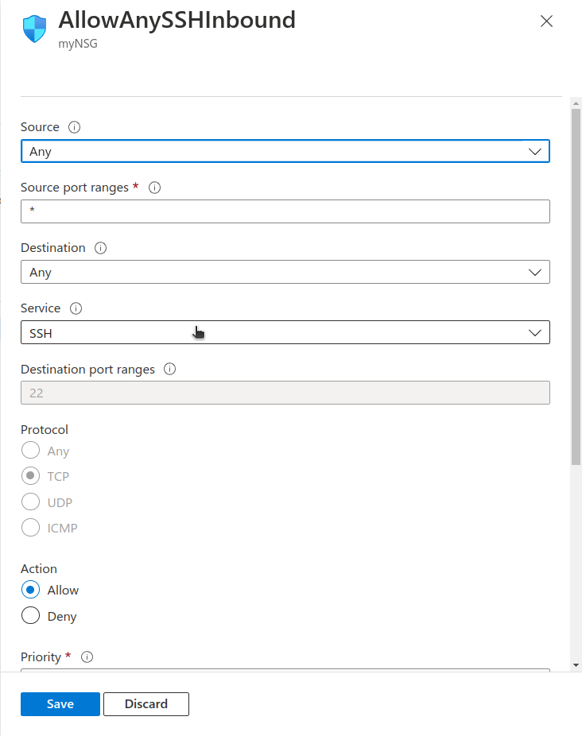
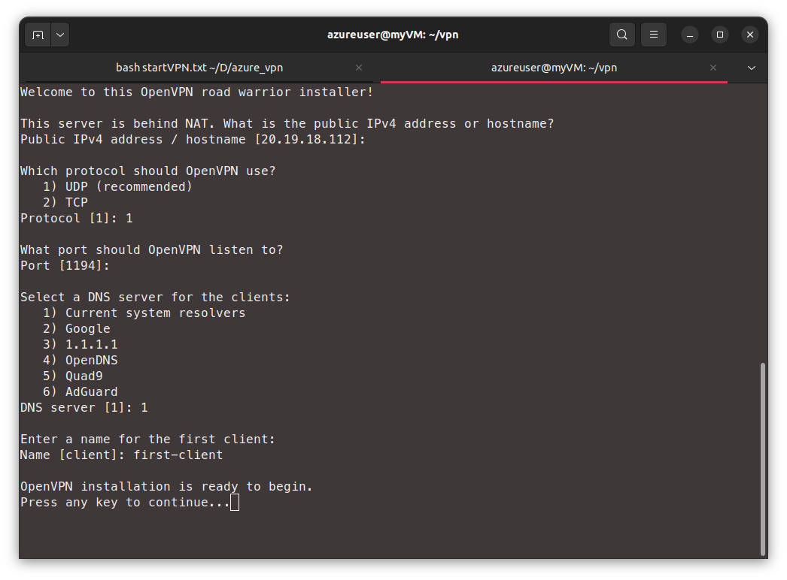

# How to create a VPN server on Azure
There are many commercial VPN providers out there. But when it comes to privacy you are allowed to be extra suspicious. That is why creating your own VPN server on your own virtual-machine maybe the way to go.

Another reason why you may want to do this is if you do not trust the authorities where you live. They can easily block your VPN provider and disrupt your work. Blocking a large cloud provider such as Microsoft Azure or AWS is much harder (unless you are China).

# Abstract
This blog post will quickly glance over the concept of VPN then proceed to explain the method of creating a virtual machine on Azure and configuring a VPN server on that machine using OpenVPN.

>I checked every step of this post on Ubuntu 22.04 and I cannot guarantee that things will go as smooth if you are using another OS.

# what is a VPN?
Virtual Private Network is a fancy way of describing a network connection that is encrypted. We create a connection between our local machine and the virtual machine in the cloud and encrypt it so that only these two machines can view the details of our traffic.

This is why you can unblock any blocked sites using a VPN. From the censor's perspective all of your traffic is going to an IP address on Microsoft's Azure cloud. 

Example, let us assume that your country censored wikipedia.org, using a VPN you connect to a VM on Azure and you request visiting wikipedia.org. you encrypt this data and send it to Azure. The censor intercepts all your traffic easily but all they see is a request going to Azure so they have to let it pass (unless you live in China) and once your data reaches the VM on Azure, it is decrypted and processed again to see the actual desired request. The VPN server then redirects you to wikipedia.org.

# how to create a virtual machine?
We will follow the official Azure documentation. Needless to say you need an account on the platform.

## But why Azure?
Why not AWS or any other provider?
The answer is that both Azure and AWS give you the ability to create virtual machines for free during the first 12 months of the subscription. I have already used up all my credit on AWS and hence I went to Azure.

But Azure also gives you 200 USD worth of credit in the first 30 days which means you can explore the services with more confidence as any unexpected charges will be covered by that $200.

## Creating a dual-stack VM
Dual stack means that our VM will have both IPv4 and IPv6 interfaces. If we only have IPv4 then any traffic that is using IPv6 will not be encrypted and will leak outside the VPN. I discovered that myself as my first VPN server was unblocking some sites but not others.


### installing Azure CLI tool
This tool allows us to connect to Azure and send commands to create and configure resources (such as a virtual machine). we use the CLI here instead of the GUI since it is easier to copy/pase commands.

To install simply open a terminal on your local machine and paste:
```
curl -sL https://aka.ms/InstallAzureCLIDeb | sudo bash
```
To confirm the installation was successful, type `az` in the terminal and you should get an output that looks like this:


### logging-in
The CLI is installed but we are not logged in, to login we type `az login` which opens a browser page where we can sign in to Azure.


### creating a virtual machine using CLI
We will follow [this official guide](https://learn.microsoft.com/en-us/azure/virtual-network/ip-services/create-vm-dual-stack-ipv6-cli "create-vm-dual-stack-ipv6-cli"){:target="_blank"} which is a bit general so we still have to configure our machine to allow traffic from UDP port 1194 which is where our VPN server will listen.

Please note that the above guide uses "eastus2" for the location of the virtual machine. this may not be the best location for you and certainly was not the best for me as it is too far. I ended up using "francecentral".

### adding security rules
We need to allow inbound traffic of type UDP on port 1194, we will do that using GUI

After logging in to https://portal.azure.com/#home we use the top search bar to search for `resource group`

From resource groups we will find the "myResourceGroup" resource group which we created using the CLI, we click on it to find the "myNSG" security group which we also created.

From there we look at the right pane for the "inbound security rules option"

From there we can add a new rule using the "+ Add" button and we create a rule to allow UDP at port 1194:



we also need a rule to allow SSH traffic on port 22:



### summary
To recap, in this section we created a resource group that has a VM, configured it with IPv4 and IPv6 and created SSH keys (automatically saved in ~/.ssh) then we added security rules to allow UDP:1194 and SSH:22 ports.

The advantage of creating resource group is that we can delete everything we created by deleting that group.
## Creating a VPN server on the VM
We now have a VM waiting for a VPN server to be installed, luckily we have an interactive installation script provided by [angristan](https://github.com/angristan/openvpn-install "install openvpn")
We connect to the VM using SSH:
```
ssh azureuser@21.190.227.112
```
You will have to use your VM's IP address which you can find in Azure by searching for "virtual machine".

To download the installation script we use:
```
mkdir vpn
cd vpn
curl -O https://raw.githubusercontent.com/angristan/openvpn-install/master/openvpn-install.sh
chmod +x openvpn-install.sh
```
Then we run the script:
```
sudo IPV6_SUPPORT=y ./openvpn-install.sh
```
we added IPv6 support using `IPV6_SUPPORT=y` environment variable.
we go through the installation steps as follows:


The result of the installation is that we'll have an openvpn server running and we also get a configuration file which we can use to setup our client machines (works on Linux, Android, Windows and Mac). that configuration file is saved in
`/home/azureuser/first-client.ovpn` and to download it to our local machine we can use a tool like SCP:
```
scp  azureuser@21.190.227.112:/home/azureuser/first-client.ovpn ./first-client.ovpn
```
We need to install openvpn client on our local machine:
```
sudo apt-get update && sudo apt-get upgrade
sudo apt -y install openvpn
```
Now all that is left is to run that configuration file as follows:
```
sudo openvpn first-client.ovpn
```
## Confirm that it works
Go to Google.com and search for "where am I", if all went well you should be in whatever Azure location you picked for the VM. 