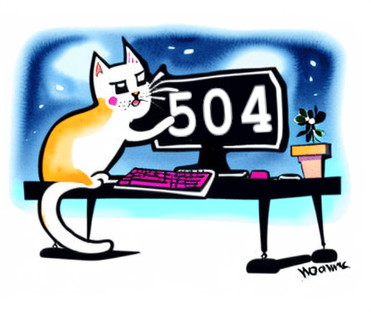

# Solve error 504 in NextJS

This post provides an outline on the steps to take when facing error 504 aka serverless function timeout.
To describe it better, when you have this error, your NextJS API endpoints will work fine in development but will not work in production.

## What causes this error?

I had just finished deploying my NextJS app to Vercel. Everything seems to work except that all of my API requests were timing out with error 504. The error preview message was something along the lines of `SERVERLESS FUNCTION TIMEOUT`!

It wasn't untill I came across this [document](https://vercel.com/docs/concepts/functions/serverless-functions/regions) that I understood the problem. The connection between my backend and my database (which was hosted on Supabase) was too slow.

NextJS is a fullstack framework, it provides means to create not only the frontend of the application but also the backend. 

Under the hood the backend API endpoints are hosted on serverless functions and this is a key fact.
If the application's database is hosted in a region that is too far from that of the serverless functions, the connection latency may cause the serverless function to timeout before the database returns the results of a query.

## Solution

As you have probably figured by now, one solution is to keep the database and the serverless functions in the same region.

## Example

In my case, I was hosting my app with Vercel and my database with Supabase. Here is how I verified the problem:

1. On Vercel, I went to the project page and from there to `Settings -> Functions`. In there I could see that the region I was on was Frankfurt, Germany.
2. On Supabase, I went to my project then to `Settings -> Infrastructure` and there I could see that my region was in the US.

To solve the problem I ended up deleting my Supabase project and creating a new one in the correct region (I had a fresh project so deleting was an option for me). Another option was to simply move the serverless functions to the region of the database but in my case, Frankfurt, Germany was closer to me than the US so I moved the database.
